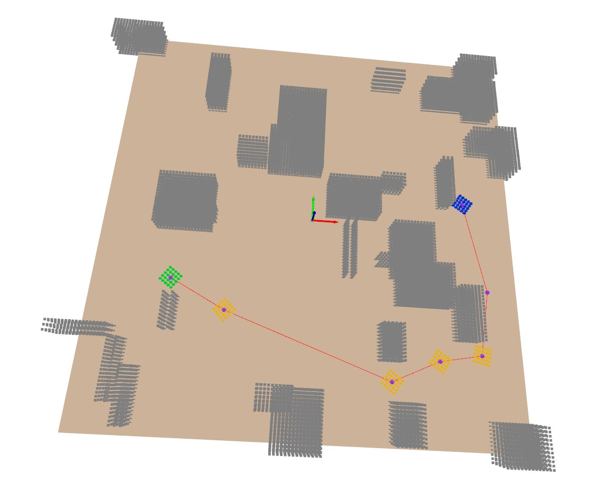

# 3D Object Planner

A high-performance, 3-DOF (x, y, theta) motion planner for moving objects in a plan. The planner finds collision-free asymptotically optimal paths using rrt* for an object represented as a point cloud among 3D obstacles.

This project is implemented in C++ for performance and wrapped in Python using `pybind11` for ease of use.


*Example of collision-free path planning for a 3D object navigating through obstacles using RRT***

## Features

-   **RRT\* Planner**: An optimal sampling-based algorithm to quickly find high-quality paths.
-   **Sphere Tree BVH**: The object is pre-processed into a Bounding Volume Hierarchy of spheres for extremely fast collision checks.
-   **SIMD Acceleration**: Collision checking is batched and accelerated using CPU vector instructions (`xsimd`) for maximum performance.
-   **KD-Tree for Obstacles**: Obstacle point clouds are structured in a KD-Tree (`nanoflann`) for efficient nearest-neighbor and radius searches.
-   **Path Smoothing**: A final shortcutting pass is applied to the RRT* path to make it smoother and more direct.
-   **Modern Build System**: Uses `pyproject.toml` with `scikit-build-core` and a `conda` environment for a reproducible and easy-to-manage build process.

## Installation

This project is best managed using the Conda package manager to ensure all C++ and Python dependencies are consistent.

```bash
git clone https://github.com/H-tr/object_planner.git
cd object_planner
conda create -n obj_planner python=3.10
conda activate obj_planner
pip install -e .
```

## Usage

Run the example to see the planner in action:

```bash
python example/run_planner.py
```
